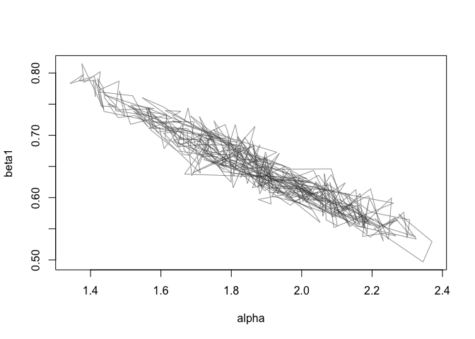

greta: probabilistic modelling with TensorFlow
==============================================

`greta` lets users write probabilistic models interactively in native R
code, then sample from those models efficiently using Hamiltonian Monte
Carlo. Most of the calculations are performed using TensorFlow, so
`greta` is particularly fast where the model contains lots of linear
algebra. `greta` models can also be run across distributed machines or
on GPUs, just by installing the relevant version of TensorFlow.

This package is in the early stages of development, so expect it to be
buggy for a while. *It is not ready for use in serious analysis*.

Future releases should stabilise and will likely enable fitting models
with fast approximate inference schemes, different samplers, and more
distributions and operations.

Example
-------

Here's an example of a hierarchical linear regression model applied to
the iris data.

    data(iris)
    library(greta)

    # define data as observed variables
    y = observed(iris[, 1])
    x = observed(as.matrix(iris[, 2:4]))

    # priors
    sigma = lognormal(0, 10)
    alpha = normal(0, 10)
    mu_beta <- normal(0, 10)
    sigma_beta <- lognormal(0, 10)

    # linear model with hierarchical structure on the m regression coefficients
    beta = normal(mu_beta, sigma_beta, dim = 3)
    z = alpha + x %*% beta

    # data likelihood term (y already defined as observed)
    y %~% normal(z, sigma)

With the model defined, we can draw samples of the parameters we care
about. This takes around 45 seconds on my laptop.

    draws <- samples(alpha, beta, sigma,
                    method = 'hmc',
                    n_samples = 500,
                    control = list(epsilon = 0.005))

    plot(draws[, 1:2],
         type = 'l',
         col = grey(0.2, 0.5))

### How fast is it?

For small to medium size (a few hundred data points) problems, STAN is
likely to be way faster than greta (not accounting for STAN's
compilation time). Where the model involves thousands of datapoints and
large linear algebra operations (e.g. multiplication of big matrices),
greta is likely to be faster than (the current version of) STAN. That's
because TensorFlow is heavily optimised for linear algebra operations.

greta also has the advantage that TensorFlow can be run across CPUs or
GPUs on lots of different machines. That means greta *should* be able to
scale to massive datasets.

When greta is a bit more mature, I'll put together some benchmarks to
give a clearer idea of when and where it will be most useful.

### Installation

`greta` can be installed from github using the devtools package

    devtools::install_github('goldingn/greta')

however `greta` depends on TensorFlow and the `tensorflow` R package,
which will need to be succesfully installed before `greta` will work. To
install `tensorflow`, you will need a working installation of python; to
have installed the correct version of TensorFlow; and then to install
tensorflow, pointing to the version of python against which TensorFlow
was installed. Full installation details can be found [at the
`tensorflow` site](https://rstudio.github.io/tensorflow/).

Why 'greta'?
------------

There's a recent convention of naming probabilistic modelling software
after pioneers in the field (e.g.
[STAN](https://en.wikipedia.org/wiki/Stanislaw_Ulam) and
[Edward](https://en.wikipedia.org/wiki/George_E._P._Box)).

[Grete Hermann](https://en.wikipedia.org/wiki/Grete_Hermann) wasn't a
probabilist, but she wrote [the first
algorithms](http://dl.acm.org/citation.cfm?id=307342&coll=portal&dl=ACM)
for computer algebra; in the 1920s, well before the first electronic
computer was built. This work laid the foundations for computer algebra
libraries (like TensorFlow) that enable modern probabilistic modelling.

In case that's not enough reason to admire her, Grete Hermann also
[disproved a popular theorem in quantum
theory](https://arxiv.org/pdf/0812.3986.pdf) and was part of the German
resistance against the Nazi regime prior to World War Two.

Grete (usually pronounced *Greh*•tuh, like its alternate spelling
*Greta*) is pretty confusing for most non-German speakers, so I've taken
the liberty of naming the package greta instead. You can call it
whatever you like.
