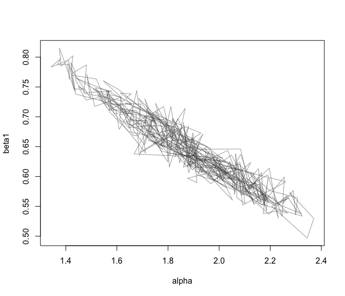

greta: probabilistic modelling with TensorFlow
==============================================

greta lets you write probabilistic models interactively in native R code, then sample from them efficiently using Hamiltonian Monte Carlo.

The computational heavy lifting is done by [TensorFlow](https://www.tensorflow.org/), Google's automatic differentiation library. greta is particularly fast where the model contains lots of linear algebra, and greta models can be easily set up to run across CPUs or GPUs, just by installing the relevant version of TensorFlow.

This package is in the early stages of development, so expect it to be buggy for a while. *It is not yet ready for use in serious analysis*.

Releases in the near future will implement more distributions and functions. Later releases will implement [different samplers](http://www.stat.columbia.edu/~gelman/research/published/nuts.pdf) and may enable fitting models with fast [approximate inference schemes](http://andrewgelman.com/2015/02/18/vb-stan-black-box-black-box-variational-bayes/) and running computations across a [distributed network](https://www.tensorflow.org/versions/r0.11/how_tos/distributed/index.html).

Example
-------

Here's an example of a hierarchical linear regression model applied to the iris data.

``` r
data(iris)
library(greta)

# define data as observed variables
y = observed(iris[, 1])
x = observed(as.matrix(iris[, 2:4]))

# priors
sigma = lognormal(0, 10)
alpha = normal(0, 10)
mu_beta = normal(0, 10)
sigma_beta = lognormal(0, 10)

# linear model with hierarchical structure on the regression coefficients
beta = normal(mu_beta, sigma_beta, dim = 3)
z = alpha + x %*% beta

# data likelihood term (y already defined as observed)
y %~% normal(z, sigma)
```

With the model defined, we can draw samples of the parameters we care about. This takes around 45 seconds on my laptop.

``` r
draws <- samples(alpha, beta, sigma,
                method = 'hmc',
                n_samples = 500)

# plot the trace for two of the parameters
plot(draws[, 1:2],
     type = 'l',
     col = grey(0.2, 0.5))
```



### How fast is it?

For small to medium size (a few hundred data points) problems, STAN is likely to be way faster than greta (not accounting for STAN's compilation time). Where the model involves thousands of datapoints and large linear algebra operations (e.g. multiplication of big matrices), greta is likely to be faster than (the current version of) STAN. That's because TensorFlow is heavily optimised for linear algebra operations.

For example, while the code above takes 45 seconds to run with the 150-row iris data, if you duplicate the iris data 1,000 times to get a dataset of 150,000 rows, it takes less than 90 seconds to draw the same number of samples. That's not bad. Not bad at all.

Those numbers are on a laptop. Since TensorFlow can be run across multiple CPUs or GPUs on lots of different machines, greta models *should* scale really well to massive datasets. When greta is a bit more mature, I'll put together some benchmarks to give a clearer idea of how it compares with other modelling software.

### Installation

greta can be installed from GitHub using the devtools package

``` r
devtools::install_github('goldingn/greta')
```

however greta depends on TensorFlow and RStudio's tensorflow R package, which will need to be succesfully installed before greta will work. To install the tensorflow R package, you will need a working installation of python; to have installed the correct version of TensorFlow; and then to point to the correct version of python when installing the tensorflow R package. Full installation details can be found at RStudio's tensorflow [website](https://rstudio.github.io/tensorflow/).

Why 'greta'?
------------

There's a recent convention of naming probabilistic modelling software after pioneers in the field (e.g. [STAN](https://en.wikipedia.org/wiki/Stanislaw_Ulam) and [Edward](https://en.wikipedia.org/wiki/George_E._P._Box)).

[Grete Hermann](https://en.wikipedia.org/wiki/Grete_Hermann) wasn't a probabilist, but she wrote [the first algorithms](http://dl.acm.org/citation.cfm?id=307342&coll=portal&dl=ACM) for computer algebra; in the 1920s, well before the first electronic computer was built. This work laid the foundations for computer algebra libraries (like TensorFlow) that enable modern probabilistic modelling.

In case that's not enough reason to admire her, Grete Hermann also [disproved a popular theorem in quantum theory](https://arxiv.org/pdf/0812.3986.pdf) and was part of the German resistance against the Nazi regime prior to World War Two.

Grete (usually said *Greh*•tuh, like its alternate spelling *Greta*) is pretty confusing for most non-German speakers pronounce, so I've taken the liberty of naming the package greta instead. You can call it whatever you like.
