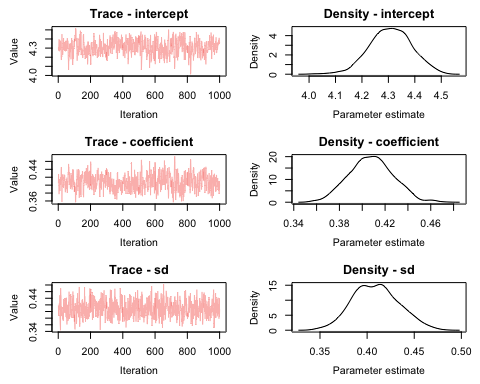
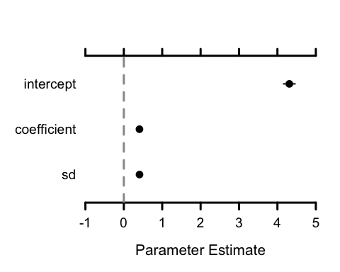

greta is an R package for writing flexible statistical models and fitting them by MCMC, it's:

**easy** - greta models can be written interactively in R, so there's no need to learn a new language like BUGS or Stan and if you make a mistake you get feedback immediately, not from a compiler.

**fast** - greta uses Google's [TensorFlow](https://www.tensorflow.org/) computational engine, meaning it's really fast on big datasets and can run in parallel across hundreds of CPUs, or on GPUs.

**extensible** - because greta is written in R, you can define your own functions and modules to add new methods and models.


### Example

Here's a simple Bayesian linear regression model applied to the iris data.

``` r
library(greta)

intercept = normal(0, 5)
coefficient = normal(0, 3)
sd = lognormal(0, 3)

mean <- intercept + coefficient * iris$Petal.Length
likelihood(iris$Sepal.Length) = normal(mean, sd)
```

With the model defined, we can draw samples of the parameters we care about.

``` r
model <- define_model(intercept, coefficient, sd)

draws <- mcmc(model, n_samples = 1000)
```

This outputs an `mcmc.list` object, so you can plot and summarise the samples using your favourite MCMC visualisation software.

``` r
library(MCMCvis)

MCMCtrace(draws)
MCMCplot(draws, xlim = c(-1, 5))
```




### Installation

greta can be installed from GitHub using the devtools package

``` r
devtools::install_github('goldingn/greta')
```

however greta depends on TensorFlow which will need to be successfully installed before greta will work. See [here](https://www.tensorflow.org/install/) for instructions on installing TensorFlow.


### How fast is it?

For small to medium size (a few hundred data points) problems, Stan will probably be faster than greta. Where the model involves thousands of datapoints and large linear algebra operations (e.g. multiplication of big matrices), greta is likely to be faster than STAN. That's because TensorFlow is heavily optimised for linear algebra operations.

For example, while the code above takes around 60 seconds to run with the 150-row iris data, if you run the same model and sampler on a dataset of 15,000 rows, it still only takes around 65 seconds. That's not bad. Not bad at all.

Those numbers are on a laptop. Since TensorFlow can be run across large numbers of CPUs, or on GPUs, greta models can be made to scale to massive datasets. When greta is a bit more mature, I'll put together some benchmarks to give a clearer idea of how it compares with other modelling software.


### Why 'greta'?

There's a recent convention of naming probabilistic modelling software after pioneers in the field (e.g. [STAN](https://en.wikipedia.org/wiki/Stanislaw_Ulam) and [Edward](https://en.wikipedia.org/wiki/George_E._P._Box)).

[Grete Hermann](https://en.wikipedia.org/wiki/Grete_Hermann) wasn't a probabilist, but she wrote [the first algorithms](http://dl.acm.org/citation.cfm?id=307342&coll=portal&dl=ACM) for computer algebra; in the 1920s, well before the first electronic computer was built. This work laid the foundations for computer algebra libraries (like TensorFlow) that enable modern probabilistic modelling.

In case that's not enough reason to admire her, Grete Hermann also [disproved a popular theorem in quantum theory](https://arxiv.org/pdf/0812.3986.pdf) and was part of the German resistance against the Nazi regime prior to World War Two.

Grete (usually said *Greh*•tuh, like its alternate spelling *Greta*) can be confusing for non-German speakers to pronounce, so I've taken the liberty of naming the package greta instead. You can call it whatever you like.


### How does it work?

##### writing a model

greta lets you create and manipulate `greta_array` objects, which behave more-or-less like R's arrays. greta arrays can contain either data, random variables (with some distribution), or the ouputs of operations on random variables. Random variables are defined either via their prior distributions (`normal()`, `beta()` etc.; see `` ?`greta-distributions` ``), or for frequentist inference using the function `free()`. greta arrays can be manipulated using R's standard arithmetic, logical and relational operators (`+`, `*`, etc., see `` ?`greta-operators` ``) and common functions (`sum()`, `log()` etc.; see `` ?`greta-functions` ``). R objects (including vectors, matrices, arrays and some dataframes) can be coerced to greta arrays using the `data()` function (see `?greta::data`), though many of the operators will automagically transform data too, like in the example above. The `likelihood()` syntax states that some observed data is assumed to follow a certain distribution, allowing us to define a model likelihood (see `?likelihood`).

##### defining and running a model

When writing a model greta doesn't actually perform any of these operations, it just remembers what to do to create a new greta array, and which existing greta arrays to use. The function `define_model()` then finds all of the greta arrays connected to the parameters we care about to create a *directed acyclic graph* (DAG) describing the model. This DAG is then translated into a TensorFlow graph, and Tensors are created for the log-density of the model, and the gradient of the log-density. `mcmc` then uses this TensorFlow graph to run a Hamiltonian Monte Carlo algorithm to sample the parameters of the model.

##### software

greta relies on some pretty incredible pieces of software, including Rstudio's [`reticulate`](https://github.com/rstudio/reticulate) and [`tensorflow`](https://rstudio.github.io/tensorflow/) packages, which bring Google TensorFlow and all things python to R. Under the hood, greta also uses Winston Chang's [`R6`](https://github.com/wch/R6) object system.

The design and scope of greta was inspired by other general-purpose like [BUGS](http://www.openbugs.net/) and [JAGS](http://mcmc-jags.sourceforge.net/), but particularly by [Stan](http://mc-stan.org/). Using TensorFlow as a backend for general-purpose statistical modelling is nothing new; [Edward](http://edwardlib.org/) does something similar for Python, and [GPflow](https://github.com/GPflow/GPflow) was a source of inspiration for the implementation of greta.


