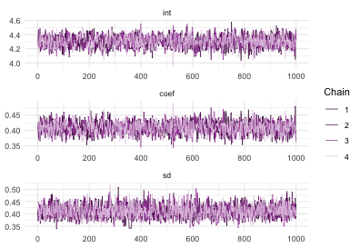

simple and scalable statistical modelling in R

**simple**

greta models are written right in R, so there’s no need to learn another
language like BUGS or Stan

**scalable**

greta uses [Google TensorFlow](https://www.tensorflow.org/) so it’s fast
even on massive datasets, and runs on CPU clusters and GPUs

**extensible**

it’s easy to write your own R functions and packages using greta

[get
started](https://greta-dev.github.io/greta/dev/articles/get_started.md)

[example
models](https://greta-dev.github.io/greta/dev/articles/example_models.md)

[package docs](https://greta-dev.github.io/greta/dev/reference/index.md)

## Basic example

Here’s a Bayesian linear regression model for the `iris` data using
greta:

``` r

x <- iris$Petal.Length
y <- iris$Sepal.Length
```

``` r

library(greta)

int <- normal(0, 5)
coef <- normal(0, 3)
sd <- lognormal(0, 3)

mean <- int + coef * x
distribution(y) <- normal(mean, sd)

m <- model(int, coef, sd)
```

``` r

draws <- mcmc(
  m,
  n_samples = 1000,
  chains = 4
  )
bayesplot::mcmc_trace(draws)
```



plot of chunk vis
