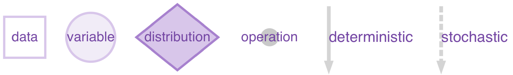

# greta model objects

Create a `greta_model` object representing a statistical model (using
`model`), and plot a graphical representation of the model. Statistical
inference can be performed on `greta_model` objects with
[`mcmc()`](https://greta-dev.github.io/greta/dev/reference/inference.md)

## Usage

``` r
model(..., precision = c("double", "single"), compile = TRUE)

# S3 method for class 'greta_model'
print(x, ...)

# S3 method for class 'greta_model'
plot(x, y, colour = "#996bc7", ...)
```

## Arguments

- ...:

  for `model`: `greta_array` objects to be tracked by the model (i.e.
  those for which samples will be retained during mcmc). If not
  provided, all of the non-data `greta_array` objects defined in the
  calling environment will be tracked. For `print` and `plot`:further
  arguments passed to or from other methods (currently ignored).

- precision:

  the floating point precision to use when evaluating this model.
  Switching from `"double"` (the default) to `"single"` may decrease the
  computation time but increase the risk of numerical instability during
  sampling.

- compile:

  whether to apply [XLA JIT compilation](https://openxla.org/xla) to the
  TensorFlow graph representing the model. This may slow down model
  definition, and speed up model evaluation.

- x:

  a `greta_model` object

- y:

  unused default argument

- colour:

  base colour used for plotting. Defaults to `greta` colours in violet.

## Value

`model` - a `greta_model` object.

`plot` - a
[`DiagrammeR::grViz()`](https://rdrr.io/pkg/DiagrammeR/man/grViz.html)
object, with the
[`DiagrammeR::dgr_graph()`](https://rdrr.io/pkg/DiagrammeR/man/create_graph.html)
object used to create it as an attribute `"dgr_graph"`.

## Details

`model()` takes greta arrays as arguments, and defines a statistical
model by finding all of the other greta arrays on which they depend, or
which depend on them. Further arguments to `model` can be used to
configure the TensorFlow graph representing the model, to tweak
performance.

The plot method produces a visual representation of the defined model.
It uses the `DiagrammeR` package, which must be installed first. Here's
a key to the plots: 

## Examples

``` r
if (FALSE) { # \dontrun{

# define a simple model
mu <- variable()
sigma <- normal(0, 3, truncation = c(0, Inf))
x <- rnorm(10)
distribution(x) <- normal(mu, sigma)

m <- model(mu, sigma)

plot(m)
} # }
```
