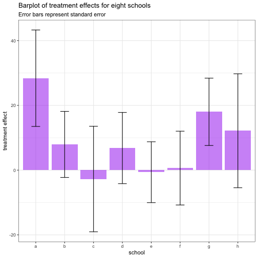
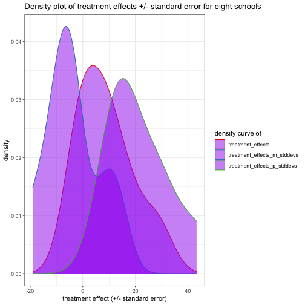
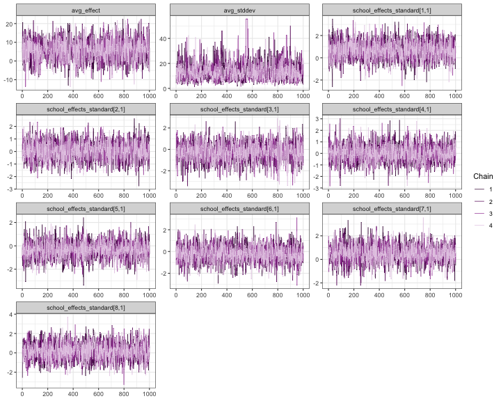
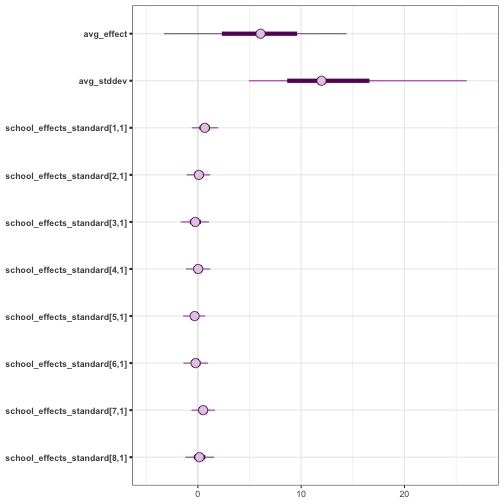
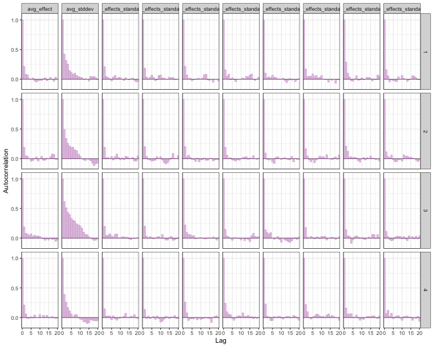
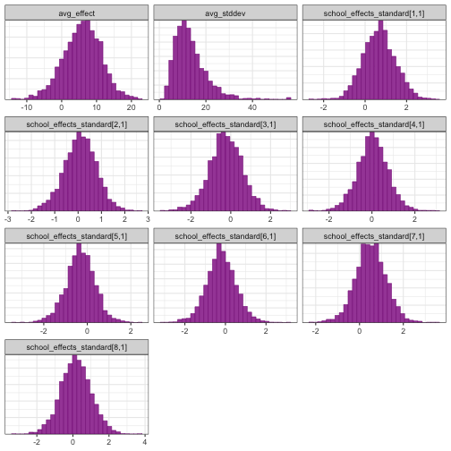
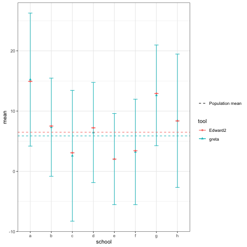

## Data

**Eight Schools** is a study of coaching effects from eight schools; it comes from [section 5.5 of Gelman et al. (2003) as covered in 2.1. Schools data of 'R2WinBUGS: A Package for Running WinBUGS from R'](https://www.jstatsoft.org/article/view/v012i03/v12i03.pdf):

> The Scholastic Aptitude Test (SAT) measures the aptitude of high-schoolers in order to help
colleges to make admissions decisions. It is divided into two parts, verbal (SAT-V) and
mathematical (SAT-M). Our data comes from the SAT-V (Scholastic Aptitude Test-Verbal)
on eight different high schools, from an experiment conducted in the late 1970s. SAT-V is a
standard multiple choice test administered by the Educational Testing Service. This Service
was interested in the effects of coaching programs for each of the selected schools.
The study included coached and uncoached pupils, about sixty in each of the eight different
schools; see Rubin (1981). All of them had already taken the PSAT (Preliminary SAT)
which results were used as covariates. For each school, the estimated treatment effect and
the standard error of the effect estimate are given. These are calculated by an analysis of
covariance adjustment appropriate for a completely randomized experiment (Rubin 1981).
This example was analysed using a hierarchical normal model in Rubin (1981) and Gelman,
Carlin, Stern, and Rubin (2003, Section 5.5).

The corresponding [TensorFlow Probability](https://medium.com/tensorflow/introducing-tensorflow-probability-dca4c304e245) Jupyter notebook can be found [here](https://github.com/tensorflow/probability/blob/master/tensorflow_probability/examples/jupyter_notebooks/Eight_Schools.ipynb).


``` r
library(greta)
library(tidyverse)
library(bayesplot)
color_scheme_set("purple")
```


``` text
# data
N <- letters[1:8]
treatment_effects <- c(28.39, 7.94, -2.75 , 6.82, -0.64, 0.63, 18.01, 12.16)
treatment_stddevs <- c(14.9, 10.2, 16.3, 11.0, 9.4, 11.4, 10.4, 17.6)
```


``` r
schools <- data.frame(N = N,
                      treatment_effects = treatment_effects,
                      treatment_stddevs = treatment_stddevs) %>%
  mutate(treatment_effects_p_stddevs = treatment_effects + treatment_stddevs,
         treatment_effects_m_stddevs = treatment_effects - treatment_stddevs)
```

For each the eight schools `N` we have the estimated treatment effect (`treatment_effects`) plus standard error (`treatment_stddevs`).
Below, we are replicating the barplot from the [TensorFlow Probability example](https://github.com/tensorflow/probability/blob/master/tensorflow_probability/examples/jupyter_notebooks/Eight_Schools.ipynb) that shows the estimated treatment effects +/- standard error per school:


``` r
ggplot(schools, aes(x = N, y = treatment_effects)) +
  geom_bar(stat = "identity", fill = "purple", alpha = 0.5) +
  geom_errorbar(aes(ymin = treatment_effects_m_stddevs, ymax = treatment_effects_p_stddevs), width = 0.3) +
  labs(x = "school", y = "treatment effect",
       title = "Barplot of treatment effects for eight schools",
       subtitle = "Error bars represent standard error")
```



A different way to plot the estimated effects and their standard errors is to plot the density distribution over the eight schools we have:


``` r
schools %>%
  gather(x, y, treatment_effects, treatment_effects_p_stddevs, treatment_effects_m_stddevs) %>%
  ggplot(aes(x = y, color = x)) +
    geom_density(fill = "purple", alpha = 0.5) +
    scale_color_brewer(palette = "Set1") +
    labs(x = "treatment effect (+/- standard error)",
         color = "density curve of",
         title = "Density plot of treatment effects +/- standard error for eight schools")
```



## Modelling with `greta`

To model the data, we use the same hierarchical normal model as in the [TensorFlow Probability example](https://github.com/tensorflow/probability/blob/master/tensorflow_probability/examples/jupyter_notebooks/Eight_Schools.ipynb).

### Variables and priors

First, we create greta arrays that represent the variables and prior distributions in our model and create a greta array for school effect from them. We define the following (random) variables and priors:

- `avg_effect`: normal density function (`dnorm`) with a mean of `0` and standard deviation of `10`; represents the prior average treatment effect.


``` r
avg_effect <- normal(mean = 0, sd = 10)
avg_effect
```

```
## greta array <variable following a normal distribution>
```

```
## 
```

```
##      [,1]
## [1,]  ?
```

```
## 
```

- `avg_stddev`: normal density function (`dnorm`) with a mean of `5` and standard deviation of `1`; controls the amount of variance between schools.


``` r
avg_stddev <- normal(5, 1)
avg_stddev
```

```
## greta array <variable following a normal distribution>
```

```
## 
```

```
##      [,1]
## [1,]  ?
```

```
## 
```

- `school_effects_standard`: normal density function (`dnorm`) with a mean of `0`, standard deviation of `1` and dimension of `8`


``` r
school_effects_standard <- normal(0, 1, dim = length(N))
school_effects_standard
```

```
## greta array <variable following a normal distribution>
```

```
## 
```

```
##      [,1]
## [1,]  ?  
## [2,]  ?  
## [3,]  ?  
## [4,]  ?  
## [5,]  ?  
## [6,]  ?  
## [7,]  ?  
## [8,]  ?
```

```
## 
```

- `school_effects`: here we multiply the exponential of `avg_stddev` with `school_effects_standard` and add `avg_effect`


``` r
school_effects <- avg_effect + exp(avg_stddev) * school_effects_standard
school_effects
```

```
## greta array <operation>
```

```
## 
```

```
##      [,1]
## [1,]  ?  
## [2,]  ?  
## [3,]  ?  
## [4,]  ?  
## [5,]  ?  
## [6,]  ?  
## [7,]  ?  
## [8,]  ?
```

```
## 
```

An alternative would be to directly use the `lognormal()` density function for `avg_stddev` and use that to calculate `school_effect`: 


``` r
avg_stddev <- lognormal(5, 1)
school_effects <- avg_effect + avg_stddev * school_effects_standard
```

### Likelihood

Next, we want to link the variables and priors with the observed dependent data - in this case the school estimate `treatment_effects`. 
We define the likelihood over our observed estimates `treatment_effects` given a random sample from the normal probability distribution with mean `school_effects` and standard deviation `treatment_stddevs`. From this, we would now like to calculate the parameter of that probability distribution by using the `distribution()` function:


``` r
distribution(treatment_effects) <- normal(school_effects, treatment_stddevs)
```

### Bayesian inference model

Now we have all the prerequisites for building a Hamiltonian Monte Carlo (HMC) to calculate the posterior distribution over the model's parameters.

We first define the model by combining the calculated `avg_effect`, `avg_stddev` and `school_effects_standard` variables so that we can sample from them during modelling. The model `m` we define below contains all our prior distributions and thus represent the combined density of the model.

It is recommended that you check your model at this step by plotting the model graph. More information about these plots can be found [here](https://greta-dev.github.io/greta/articles/get_started.html#plotting).


``` r
# defining the hierarchical model
m <- model(avg_effect, avg_stddev, school_effects_standard)
m
```

```
## greta model
```


``` r
plot(m)
```

```
## Error in `loadNamespace()`:
## ! there is no package called 'webshot'
```

The actual sampling from the model happens with the `mcmc()` function. By default 1000 MCMC samples are drawn after warm-up.
What we obtain is a probability measure that describes the likelihood of a set of randomly sampled values for the model variables.


``` r
# sampling
draws <- greta::mcmc(m, n_samples = 1000, warmup = 1000, chains = 4)
```


``` r
summary(draws)
```

```
## 
## Iterations = 1:1000
## Thinning interval = 1 
## Number of chains = 4 
## Sample size per chain = 1000 
## 
## 1. Empirical mean and standard deviation for each variable,
##    plus standard error of the mean:
## 
##                                  Mean     SD Naive SE Time-series SE
## avg_effect                    5.87678 5.4426  0.08606        0.10830
## avg_stddev                   13.40841 7.0857  0.11203        0.27954
## school_effects_standard[1,1]  0.67411 0.7820  0.01236        0.01495
## school_effects_standard[2,1]  0.09282 0.6927  0.01095        0.01316
## school_effects_standard[3,1] -0.25475 0.8356  0.01321        0.01656
## school_effects_standard[4,1]  0.03570 0.7181  0.01135        0.01406
## school_effects_standard[5,1] -0.31800 0.6664  0.01054        0.01285
## school_effects_standard[6,1] -0.20596 0.7279  0.01151        0.01475
## school_effects_standard[7,1]  0.51233 0.7026  0.01111        0.01389
## school_effects_standard[8,1]  0.16901 0.8416  0.01331        0.01527
## 
## 2. Quantiles for each variable:
## 
##                                 2.5%     25%      50%     75%   97.5%
## avg_effect                   -5.4189  2.3251  6.07327  9.6079 16.2865
## avg_stddev                    4.1059  8.6478 11.96866 16.6080 30.7303
## school_effects_standard[1,1] -0.8176  0.1569  0.67572  1.1813  2.2028
## school_effects_standard[2,1] -1.3271 -0.3637  0.10055  0.5608  1.4417
## school_effects_standard[3,1] -1.9717 -0.7758 -0.25225  0.2931  1.3550
## school_effects_standard[4,1] -1.4121 -0.4139  0.03141  0.4949  1.4325
## school_effects_standard[5,1] -1.7014 -0.7323 -0.31240  0.1113  0.9982
## school_effects_standard[6,1] -1.6594 -0.6642 -0.21959  0.2563  1.2561
## school_effects_standard[7,1] -0.8839  0.0685  0.51469  0.9672  1.8789
## school_effects_standard[8,1] -1.5167 -0.3868  0.15325  0.7181  1.8697
```


``` r
mcmc_trace(draws, facet_args = list(ncol = 3))
```




``` r
mcmc_intervals(draws)
```




``` r
mcmc_acf_bar(draws)
```




``` r
mcmc_hist(draws, facet_args = list(ncol = 3))
```

```
## `stat_bin()` using `bins = 30`. Pick better value `binwidth`.
```




#### Use of `calculate()` for transforming estimates to natural scale


The `calculate()` function can be used with the transformation function
used in building the model to get the school-specific posteriors chains.  This
function is also how you would get posterior predictive values.


``` r
# Calculate school effects on original scale
school_effects           <- avg_effect + avg_stddev * school_effects_standard
posterior_school_effects <- calculate(school_effects, values = draws) 
```


#### Comparison with Edward2 HMC

As a sanity check that we parameterized our model correctly, we can compare the
back-transformed school-specific estimates to the results from the Edward2
approach [in the TensorFlow Probability
documentation](https://github.com/tensorflow/probability/blob/master/tensorflow_probability/examples/jupyter_notebooks/Eight_Schools.ipynb).
The results are very similar.


``` r
# Posterior means via Edward2
edward2_school_means <-
  data.frame(tool = "Edward2",
             school = N,
             #mean_school_effects_standard = c(0.61157268, 0.06430732, -0.25459746,
             #                                 0.04828103, -0.36940941, -0.23154463,
             #                                 0.49402338,  0.13042814),
             mean = c(14.93237686, 7.50939941, 3.07602358, 7.21652555,
                                     2.0329783, 3.41213799, 12.92509365, 8.36702347),
             sd = 0)

edward2_pop_mean <- data.frame(tool = "Edward2", 'mean' = 6.48866844177, 'sd' = 0)
# hmc_mean_avg_stddev <- 2.46163249016


posterior_school_effects <- as.data.frame(as.matrix(posterior_school_effects))

# Relabel school measures
colnames(posterior_school_effects) <- N

# Summarise and combine all chains of interest for plotting
posterior_summaries <-
  posterior_school_effects %>%
  gather(key = school, value = value) %>% 
  group_by(school) %>%
  summarise_all(funs(mean, sd)) 
```

```
## Warning: `funs()` was deprecated in dplyr 0.8.0.
## ℹ Please use a list of either functions or lambdas:
## 
## # Simple named list: list(mean = mean, median = median)
## 
## # Auto named with `tibble::lst()`: tibble::lst(mean, median)
## 
## # Using lambdas list(~ mean(., trim = .2), ~ median(., na.rm = TRUE))
## Call `lifecycle::last_lifecycle_warnings()` to see where this warning was
## generated.
```

``` r
school_summaries <- 
  posterior_summaries %>% 
  mutate(tool = "greta") %>%
  rbind(edward2_school_means)

population_parameters <- 
  as.data.frame(as.matrix(draws)) %>% 
  select(avg_effect) %>%
  summarise_all(funs(mean, sd)) %>%
  mutate(tool = "greta") %>%
  rbind(edward2_pop_mean)
```

```
## Warning: `funs()` was deprecated in dplyr 0.8.0.
## ℹ Please use a list of either functions or lambdas:
## 
## # Simple named list: list(mean = mean, median = median)
## 
## # Auto named with `tibble::lst()`: tibble::lst(mean, median)
## 
## # Using lambdas list(~ mean(., trim = .2), ~ median(., na.rm = TRUE))
## Call `lifecycle::last_lifecycle_warnings()` to see where this warning was
## generated.
```

``` r
ggplot(school_summaries, aes(x = school, y = mean, color = tool, shape = tool)) + 
  geom_errorbar(aes(ymin = mean - sd, ymax = mean + sd), width = 0.2) +
  geom_point() +
  geom_hline(data = population_parameters, 
             aes(yintercept = mean, linetype = 'Population mean', color = tool)) +
  scale_linetype_manual(name = "", values = c(2, 2)) 
```



## Session information

<div class="fold o">

``` r
sessionInfo()
```

```
## R version 4.6.0 (2026-04-24)
## Platform: aarch64-apple-darwin23
## Running under: macOS Tahoe 26.5.1
## 
## Matrix products: default
## BLAS:   /Library/Frameworks/R.framework/Versions/4.6/Resources/lib/libRblas.0.dylib 
## LAPACK: /Library/Frameworks/R.framework/Versions/4.6/Resources/lib/libRlapack.dylib;  LAPACK version 3.12.1
## 
## locale:
## [1] en_US.UTF-8/en_US.UTF-8/en_US.UTF-8/C/en_US.UTF-8/en_US.UTF-8
## 
## time zone: Australia/Melbourne
## tzcode source: internal
## 
## attached base packages:
## [1] stats     graphics  grDevices utils     datasets  methods   base     
## 
## other attached packages:
##  [1] lubridate_1.9.5  forcats_1.0.1    stringr_1.6.0    dplyr_1.2.1     
##  [5] purrr_1.2.2      readr_2.2.0      tidyr_1.3.2      tibble_3.3.1    
##  [9] ggplot2_4.0.3    tidyverse_2.0.0  bayesplot_1.15.0 greta_0.6.0     
## [13] knitr_1.51      
## 
## loaded via a namespace (and not attached):
##  [1] tidyselect_1.2.1     farver_2.1.2         tensorflow_2.20.0   
##  [4] S7_0.2.2             fastmap_1.2.0        tensorA_0.36.2.1    
##  [7] digest_0.6.39        timechange_0.4.0     lifecycle_1.0.5     
## [10] rsvg_2.7.0           processx_3.9.0       magrittr_2.0.5      
## [13] posterior_1.7.0      compiler_4.6.0       rlang_1.2.0         
## [16] progress_1.2.3       tools_4.6.0          yaml_2.3.12         
## [19] igraph_2.3.2         askpass_1.2.1        prettyunits_1.2.0   
## [22] labeling_0.4.3       htmlwidgets_1.6.4    curl_7.1.0          
## [25] reticulate_1.46.0    plyr_1.8.9           RColorBrewer_1.1-3  
## [28] abind_1.4-8          withr_3.0.2          sys_3.4.3           
## [31] grid_4.6.0           future_1.70.0        globals_0.19.1      
## [34] scales_1.4.0         MASS_7.3-65          cli_3.6.6           
## [37] DiagrammeR_1.0.12    crayon_1.5.3         DiagrammeRsvg_0.1   
## [40] generics_0.1.4       otel_0.2.0           rstudioapi_0.18.0   
## [43] reshape2_1.4.5       tzdb_0.5.0           tfruns_1.5.4        
## [46] visNetwork_2.1.4     parallel_4.6.0       base64enc_0.1-6     
## [49] vctrs_0.7.3          V8_8.2.0             Matrix_1.7-5        
## [52] jsonlite_2.0.0       callr_3.8.0          hms_1.1.4           
## [55] listenv_0.10.1       credentials_2.0.3    glue_1.8.1          
## [58] parallelly_1.47.0    codetools_0.2-20     distributional_0.7.0
## [61] stringi_1.8.7        gtable_0.3.6         pillar_1.11.1       
## [64] htmltools_0.5.9      openssl_2.4.1        R6_2.6.1            
## [67] evaluate_1.0.5       lattice_0.22-9       png_0.1-9           
## [70] backports_1.5.1      tfautograph_0.3.2    Rcpp_1.1.1-1.1      
## [73] coda_0.19-4.1        checkmate_2.3.4      whisker_0.4.1       
## [76] xfun_0.58            pkgconfig_2.0.3
```
</div>

