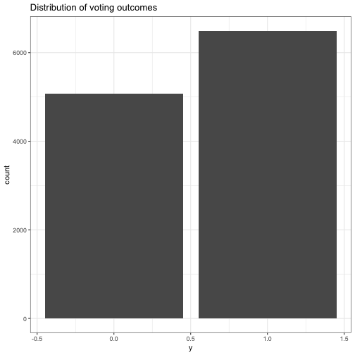
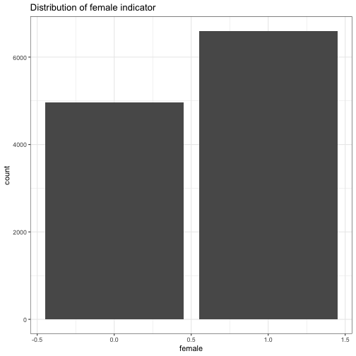
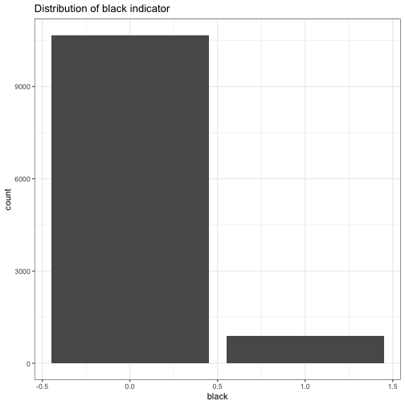
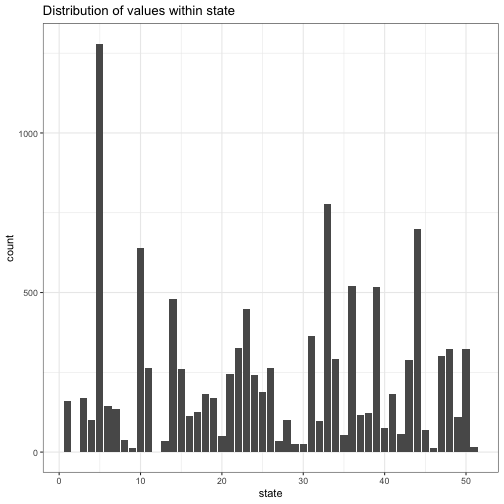
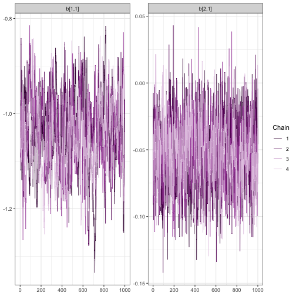
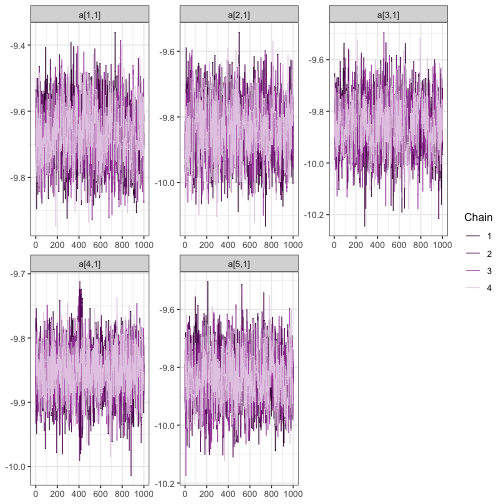
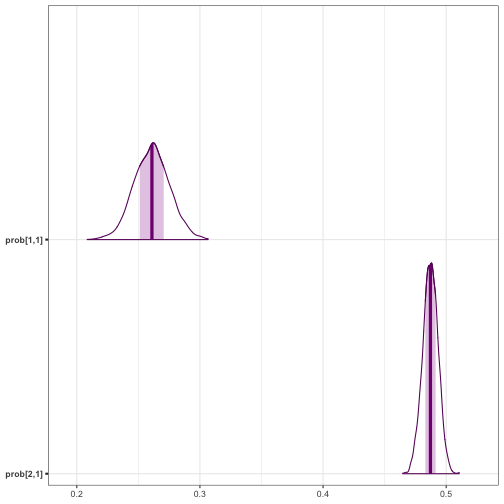

# Introduction

This model appears in chapter 14 of
[Gelman and Hill](http://www.stat.columbia.edu/~gelman/arm), which is a
discussion state-level voting outcomes. Individual responses (`y`) are labelled
as 1 for supporters of the Republican candidate and 0 for supporters of the
Democrat (with undecideds excluded).


``` r
library(tidyverse)
library(bayesplot)
library(future)
library(greta)
theme_set(theme_bw())
```


``` r
packageVersion("greta")
```

```
## [1] '0.6.0'
```

To access this data, we'll directly source a script from the `stan-dev` GitHub
repo. See the
[README](https://github.com/stan-dev/example-models/blob/master/ARM/Ch.14/README)
file for more information on the contents of the script.


``` r
root <- "https://raw.githubusercontent.com/stan-dev/example-models/master"
model_data <- "ARM/Ch.14/election88_full.data.R"
source(file.path(root, model_data))
ls()
```

```
## [1] "base"       "model_data" "old"        "rel"        "root"      
## [6] "work_dir"
```

Using this data, we will look to answer the following: **what effect did race
and gender have on voting outcomes in the 1988 election**. While we cannot
answer this question in causal terms without experimental data, we can at least
answer this data in observational terms.

We'll implement a multi-level model with varying intercepts. In `lme4` syntax,
that's

```
glmer(y ~ black + female + (1 | state), family = binomial(link = "logit"))
```

Where `black` identifies whether or not the respondent is black. 1 for 'yes' and
0 for 'no'. `female` is a similar flag: 1 for 'yes' and 0 for 'no'. State is
numerically encoded values, equivalent to the data component of a factor
variable.

The equivalent Stan model is

```
data {
  int<lower=0> N; 
  int<lower=0> n_state; 
  vector<lower=0,upper=1>[N] black;
  vector<lower=0,upper=1>[N] female;
  int<lower=1,upper=n_state> state[N];
  int<lower=0,upper=1> y[N];
} 
parameters {
  vector[n_state] a;
  vector[2] b;
  real<lower=0,upper=100> sigma_a;
  real mu_a;
}
transformed parameters {
  vector[N] y_hat;

  for (i in 1:N)
    y_hat[i] = b[1] * black[i] + b[2] * female[i] + a[state[i]];
} 
model {
  mu_a ~ normal(0, 1);
  a ~ normal (mu_a, sigma_a);
  b ~ normal (0, 100);
  y ~ bernoulli_logit(y_hat);
}
```

# Exploring the data

To begin, we'll plot values for each of the values that we'll be working
with.

The target (voting outcome):


``` r
data.frame(y) %>% 
  ggplot(aes(y)) +
  geom_bar() +
  ggtitle("Distribution of voting outcomes")
```



Here's the gender indicator.


``` r
data.frame(female) %>% 
  ggplot(aes(female)) +
  geom_bar() +
  ggtitle("Distribution of female indicator")
```



Here's the race indicator.


``` r
data.frame(black) %>% 
  ggplot(aes(black)) +
  geom_bar() +
  ggtitle("Distribution of black indicator")
```



Here's the state variable. We have 51 state codes in the data, which includes
Washington, DC.


``` r
data.frame(state) %>% 
  ggplot(aes(state)) +
  geom_bar() +
  ggtitle("Distribution of values within state")
```



On the other, there are no observations for states 2 or 12. We'll drop them
from the model.


``` r
state_recoded <- dplyr::dense_rank(state)
table(state_recoded)
```

```
## state_recoded
##    1    2    3    4    5    6    7    8    9   10   11   12   13   14   15   16 
##  159  168  101 1280  145  134   37   13  641  264   34  479  261  113  127  183 
##   17   18   19   20   21   22   23   24   25   26   27   28   29   30   31   32 
##  169   49  246  325  447  240  189  263   35  102   24   24  363   96  777  292 
##   33   34   35   36   37   38   39   40   41   42   43   44   45   46   47   48 
##   54  521  115  124  517   75  183   56  290  698   69   12  302  323  109  323 
##   49 
##   15
```


# Building the model

Switching into  `greta`, we'll start by defining the data objects to use in our
model.


``` r
n <- length(y)
n_states <- max(state_recoded)

y_greta <- as_data(y)
black_greta <- as_data(black)
female_greta <- as_data(female)
state_greta <- as_data(state_recoded)
```

Now, we'll set up the model components. First, the random effects. To match the
Stan code above, we'll store all of these in an `a` vector. We specify the
number of effects using the `dim` parameter below.


``` r
mu_a <- normal(0, 1)
sigma_a <- variable(lower = 0.0, upper = 100.0)
a <- normal(mu_a, sigma_a, dim = n_states)
```

We can use a similar approach to get the fixed effects in a single vector. We'll
have two effects.


``` r
b <- normal(0, 100, dim = 2)
```

We will define the distribution of the outcome variable, `y`, as a
transformation of a linear combination of the inputs above.


``` r
y_hat <- b[1] * black_greta + b[2] * female_greta + a[state_recoded]
p <- ilogit(y_hat)
distribution(y_greta) <- binomial(n, p)
```

And finally, we assemble the components that we wish to sample in a model.


``` r
e88_model <- model(b, a, precision = "double")
```

Let's check out our graph.


``` r
plot(e88_model)
```

```
## Error in `loadNamespace()`:
## ! there is no package called 'webshot'
```

# Inference

Model in hand, we can begin sampling. Since we are sampling across multiple
chains, we'll use the "multisession" future strategy to do everything in
parallel.


``` r
draws <- mcmc(e88_model, warmup = 1000, n_samples = 1000, chains = 4)
```

Time to diagnose. Did the sample chains for our fixed effects mix reasonably?
For all of the following visualizations, we'll rely on the `bayesplot` package.


``` r
bayesplot::mcmc_trace(draws, regex_pars = "b\\[[.[12]")
```



And what about the random effects? We'll investigate the first 5. Remember,
we've recoded the previous state vector to remove the levels 2 and 12, which
didn't have any observations.


``` r
bayesplot::mcmc_trace(draws, regex_pars = "a\\[[1-5]\\,")
```



Understanding our coefficients in their current form is a little hard, since
they are on the logit scale. It would be nicer to work with probabilities. We
can use `calculate` for this step.

To get every transformed version of our model parameters, we pass the `draws`
object as the second argument. To get the name in an expected manner, we
will assign the transformation to a local variable first.


``` r
prob <- ilogit(b)
as_probs <- calculate(prob, values = draws)
```

And now a plot.


``` r
mcmc_areas(as_probs)
```



And the summarized results.


``` r
summary(as_probs)
```

```
## 
## Iterations = 1:1000
## Thinning interval = 1 
## Number of chains = 4 
## Sample size per chain = 1000 
## 
## 1. Empirical mean and standard deviation for each variable,
##    plus standard error of the mean:
## 
##             Mean      SD  Naive SE Time-series SE
## prob[1,1] 0.2609 0.01445 2.284e-04      0.0008900
## prob[2,1] 0.4871 0.00621 9.819e-05      0.0001757
## 
## 2. Quantiles for each variable:
## 
##             2.5%    25%    50%    75%  97.5%
## prob[1,1] 0.2325 0.2511 0.2610 0.2706 0.2894
## prob[2,1] 0.4746 0.4831 0.4872 0.4914 0.4991
```

# Wrapping up

We can finally go back to the question posed at this beginning of this example.
During the 1988 election a black voter, from a randomly selected state, had
a .25 to .27 probability of voting for Reagan, while women had .48 to .49
probability of voting for the Republican candidate.

## Session information

<div class="fold o">

``` r
sessionInfo()
```

```
## R version 4.6.1 (2026-06-24)
## Platform: aarch64-apple-darwin23
## Running under: macOS Tahoe 26.5.1
## 
## Matrix products: default
## BLAS:   /Library/Frameworks/R.framework/Versions/4.6/Resources/lib/libRblas.0.dylib 
## LAPACK: /Library/Frameworks/R.framework/Versions/4.6/Resources/lib/libRlapack.dylib;  LAPACK version 3.12.1
## 
## locale:
## [1] en_US.UTF-8/en_US.UTF-8/en_US.UTF-8/C/en_US.UTF-8/en_US.UTF-8
## 
## time zone: Australia/Hobart
## tzcode source: internal
## 
## attached base packages:
## [1] stats     graphics  grDevices utils     datasets  methods   base     
## 
## other attached packages:
##  [1] future_1.70.0    lubridate_1.9.5  forcats_1.0.1    stringr_1.6.0   
##  [5] dplyr_1.2.1      purrr_1.2.2      readr_2.2.0      tidyr_1.3.2     
##  [9] tibble_3.3.1     ggplot2_4.0.3    tidyverse_2.0.0  bayesplot_1.15.0
## [13] greta_0.6.0      knitr_1.51      
## 
## loaded via a namespace (and not attached):
##  [1] tidyselect_1.2.1     farver_2.1.2         tensorflow_2.20.0   
##  [4] S7_0.2.2             fastmap_1.2.0        tensorA_0.36.2.1    
##  [7] digest_0.6.39        timechange_0.4.0     lifecycle_1.0.5     
## [10] rsvg_2.7.0           processx_3.9.0       magrittr_2.0.5      
## [13] posterior_1.7.0      compiler_4.6.1       rlang_1.3.0         
## [16] progress_1.2.3       tools_4.6.1          yaml_2.3.12         
## [19] igraph_2.3.3         askpass_1.2.1        prettyunits_1.2.0   
## [22] labeling_0.4.3       htmlwidgets_1.6.4    curl_7.1.0          
## [25] reticulate_1.46.0    plyr_1.8.9           RColorBrewer_1.1-3  
## [28] abind_1.4-8          withr_3.0.3          sys_3.4.3           
## [31] grid_4.6.1           ggridges_0.5.7       globals_0.19.1      
## [34] scales_1.4.0         MASS_7.3-66          cli_3.6.6           
## [37] DiagrammeR_1.0.12    crayon_1.5.3         DiagrammeRsvg_0.1   
## [40] generics_0.1.4       otel_0.2.0           rstudioapi_0.19.0   
## [43] reshape2_1.4.5       tzdb_0.5.0           tfruns_1.5.4        
## [46] visNetwork_2.1.4     parallel_4.6.1       base64enc_0.1-6     
## [49] vctrs_0.7.3          V8_8.2.0             Matrix_1.7-5        
## [52] jsonlite_2.0.0       callr_3.8.0          hms_1.1.4           
## [55] listenv_0.10.1       credentials_2.0.3    glue_1.8.1          
## [58] parallelly_1.47.0    codetools_0.2-20     distributional_0.7.0
## [61] stringi_1.8.7        gtable_0.3.6         pillar_1.11.1       
## [64] htmltools_0.5.9      openssl_2.4.1        R6_2.6.1            
## [67] evaluate_1.0.5       lattice_0.22-9       png_0.1-9           
## [70] backports_1.5.1      tfautograph_0.3.2    Rcpp_1.1.2          
## [73] coda_0.19-4.1        checkmate_2.3.4      whisker_0.4.1       
## [76] xfun_0.60            pkgconfig_2.0.3
```
</div>

