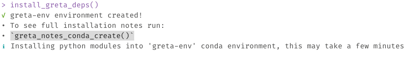
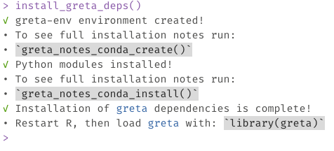
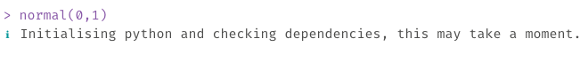
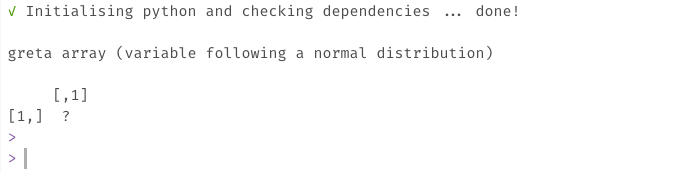
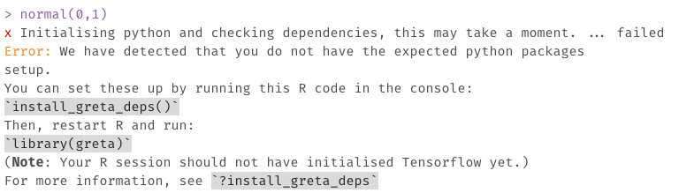

```{r, include = FALSE}
knitr::opts_chunk$set(
  collapse = TRUE,
  comment = "#>",
  echo = FALSE,
  out.width = "100%"
)
```

# How do I install `greta` dependencies?

Before you can fit models with `greta`, you will also need to have a working installation of Google's [TensorFlow](https://www.tensorflow.org/) python package (version 1.14.0) and the [tensorflow-probability](https://github.com/tensorflow/probability) python package (version 0.7.0). In the future we will support different versions of Tensorflow and Tensorflow Probability, but currently we need these exact versions.

To assist with installing these Python packages, `greta` provides an installation helper, `install_greta_deps()`, which installs the exact pythons package versions needed. It also places these inside a "greta-env" conda environment. This isolates these exact python modules from other python installations, so that only `greta` will see them. This helps avoids installation issues, where previously you might update tensorflow on your computer and overwrite the current version needed by `greta`. Using this "greta-env" conda environment means installing other python packages should not be impact the Python packages needed by `greta`.

If these python modules aren't yet installed, when `greta` is used, it provides instructions on how to install them for your system. If in doubt follow those. 

The installation process should look something like so:

```{r show-installation-process}
knitr::include_graphics("../man/figures/greta-install-p1.png")
```

```{r show-installation-process-2}

```

```{r show-installation-process-3, out.width = "60%"}

```

# How do I know if `greta` has the right versions of Python dependencies installed?

You can check if `greta` has the right dependencies installed by first running `library(greta)`, then running some `greta` code, such as:

```{r run-greta, eval = FALSE}
normal(0,1)
```

This should look something like the following.

First, `library(greta)` gives you a message about which objects are masked from base R (these only apply to greta arrays, so will not impact other use of functions like `%*%`, `rowMeans`, etc).

```{r show-library-call}
knitr::include_graphics("../man/figures/greta-load-library.png")
```

Then, when you run some greta code like `normal(0,1)`, Python will be initialised, and it will search for the dependencies it needs (tensorflow, and tensorflow probability)

```{r show-greta-initialising}

```

When that is complete, it will look like so:

```{r show-greta-initialised}

```

If python is not detected, or there is an issue with identifying the right python packages, you might see this error:

```{r show-greta-fail}

```

In which case we recommend restarting R, and re-running `install_greta_deps()`. If this does not work there is another installation approach below. 

# Is there an alternative way to install Python dependencies?

If the previous installation helper did not work, you can try the following:

```{r install_tensorflow, eval = FALSE, echo = TRUE}
reticulate::install_miniconda()
reticulate::conda_create(
        envname = "greta-env-tf2",
        python_version = "3.8"
      )
reticulate::py_install(
  packages = c(
    'numpy',
    'tensorflow',
    'tensorflow-probability'
  ),
  envname = "greta-env-tf2",
  pip = TRUE
)
```

Which will install the python modules into a conda environment named "greta-env".

If these instructions do not work for you, please post on the [greta forum](https://forum.greta-stats.org/) and we will respond to you as soon as we can.

# Does greta work on Mac Laptops with an M1 Chip?

We are still working on getting `greta` to work on Mac Laptops with an M1 chip. Current progress can be tracked at [this issue on github](https://github.com/greta-dev/greta/issues/458).

# I get the message: "Your CPU supports instructions that this TensorFlow binary was not compiled to use: AVX AVX2"

Briefly, this is a warning that you can safely ignore. Less briefly, it means that there can be some optimisations made with a special install of tensorflow that mean it will run faster on your machine. For more details, see [this stack overflow thread](https://stackoverflow.com/a/47227886/3764040). We have noted this issue in [this github issue](https://github.com/greta-dev/greta/issues/472), and might in the future make it easier to resolve.
