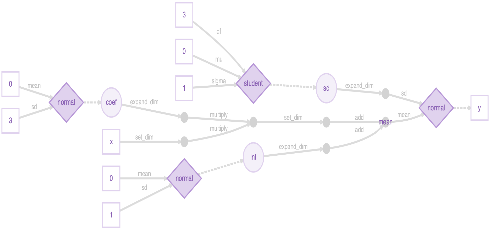
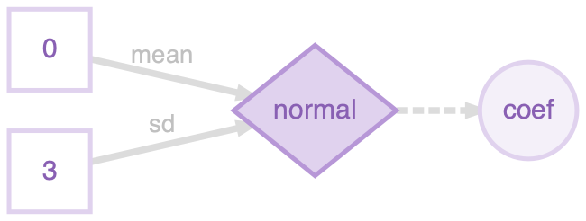
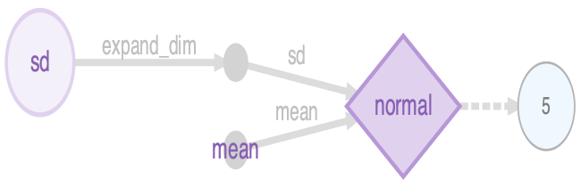

```{r setup, include = FALSE}

knitr::opts_chunk$set(echo = TRUE,
                      eval = greta:::check_tf_version("message"),
                      cache = TRUE,
                      comment = NA,
                      progress = FALSE)

set.seed(2018-07-02)

library(greta)

if (!file.exists("figures"))
  dir.create("figures")

file.copy("../man/figures/plotlegend.png",
          "figures/plotlegend.png")
```

## Installation

You can install the stable version of greta from CRAN:

```{r install_greta, eval = FALSE}
install.packages("greta")
```

or the development version from GitHub using devtools:

```{r install_greta_github, eval = FALSE}
devtools::install_github("greta-dev/greta")
```

then load the package

```{r load}
library(greta)
```

<hr>

### Helper functions to install TensorFlow

Before you can fit models with `greta`, you will also need to have a working installation of Google's [TensorFlow](https://www.tensorflow.org/) python package (version >= 2.0.0) and the [tensorflow-probability](https://github.com/tensorflow/probability) python package (version >= 0.8.0).

If these python modules aren't yet installed when `greta` is used, it suggests to use `install_greta_deps()` to install the dependencies. We recommend using this function to install dependencies. For more detail on installation, see the vignette "installation".

<!-- If you want `greta` to run as fast as possible on your computer's CPUs, it would be worth installing python and TensorFlow using Anaconda since they will be automatically configured to use Intel's MKL routines, which provide a 2-8 fold sampling speedup on most models. -->

<hr>

### DiagrammeR

greta's [plotting functionality](#plotting) depends on the [DiagrammeR package](https://rich-iannone.github.io/DiagrammeR/). Because DiagrammeR depends on the [igraph](https://igraph.org/r/) package, which contains a large amount of code that needs to be compiled, DiagrammeR often takes a long time to install. So, DiagrammeR isn’t installed automatically with greta. If you want to plot greta models, you can install igraph and DiagrammeR from CRAN.

```{r install_diagrammer, eval = FALSE}
install.packages("igraph")
install.packages("DiagrammeR")
```

igraph can be difficult to install on some machines, due to dependencies on the [XML](https://CRAN.R-project.org/package=XML) R package and libxml2 and gfortran software libraries. There are workarounds to these issues (e.g. [here](https://stat.ethz.ch/pipermail/r-help//2018-February/451279.html) and  [here](https://askubuntu.com/questions/859256/how-to-install-gcc-7-or-clang-4-)) but if you can't get it to work, you can still use greta for everything except plotting models.

<hr>

## How greta works

greta lets us build statistical models interactively in R, and then sample from them by MCMC. We build greta models with *greta array* objects, which behave much like R's array, matrix and vector objects for numeric data. Like those numeric data objects, greta arrays can be manipulated with functions and mathematical operators to create new greta arrays.

The key difference between greta arrays and numeric data objects is that when you do something to a greta array, greta *doesn't calculate the values* of the new greta array. Instead, it just remembers what operation to do, and works out the size and shape of the result.

For example, we can create a greta array `z` representing some data (a 3x3 matrix of 1s):
```{r ones}
(z <- ones(3, 3))
```
we can then create a new greta array `z2` by doing something to `z`:
```{r ones_op}
(z2 <- z + z ^ 2)
```
greta knows the result must also be a 3x3 matrix, but it doesn't try to calculate the results. Instead it treats the new greta array `z2` like a placeholder, for which it will calculate the results later.

Because greta only creates *placeholders* when we're building our model, we can construct models using greta arrays that represent unknown variables. For example, if we create a new greta array `a` representing some unknown values, we can still manipulate it as though it were data:

```{r variable}
(a <- variable(dim = c(3, 3)))
(a2 <- a + a ^ 2)
```

This allows us to create a wide range of models, like in the general-purpose modelling languages like BUGS and Stan. But unlike those languages we build greta models interactively in R so get feedback immediately if there's a mistake like a misspelled variable name or if one of our greta arrays has the wrong shape.

greta also lets us declare that a greta array follows a probability distribution, allowing us to train models using observed data, and to define prior distributions over our parameters, for Bayesian analyses.

The rest of this vignette walks through an example of fitting a model using greta.
If you'd like to see examples of some common models fitted in greta and with equivalent BUGS and Stan code, take a look at [Example models](https://greta-stats.org/articles/example_models.html).
If you'd like more technical details about how greta works under the hood, check out [Technical details](https://greta-stats.org/articles/webpages/technical_details.html).

<hr>

## Building a model

The rest of the vignette explains step-by-step how to build, visualise and fit a model with greta. We'll be stepping through a model for linear regression between two of the variables in the [`iris`](https://en.wikipedia.org/wiki/Iris_flower_data_set) dataset, which is included with base R. The model is *Bayesian* (we specify priors over the variables), though it is also possible to do frequentist (no priors) inference in greta, using `variable()` instead of a probability distribution to create random variables.

Here's the whole script to specify and fit the model:

```{r first_model, eval = FALSE}
library(greta)

# data
x <- as_data(iris$Petal.Length)
y <- as_data(iris$Sepal.Length)

# variables and priors
int <- normal(0, 1)
coef <- normal(0, 3)
sd <- student(3, 0, 1, truncation = c(0, Inf))

# operations
mean <- int + coef * x

# likelihood
distribution(y) <- normal(mean, sd)

# defining the model
m <- model(int, coef, sd)

# plotting
plot(m)

# sampling
draws <- mcmc(m, n_samples = 1000)
```

<hr>

### Data

The first section of the script takes the iris data (which is automatically loaded) and converts the two columns we care about into greta arrays:

```{r data}
x <- as_data(iris$Petal.Length)
y <- as_data(iris$Sepal.Length)
```

The greta function `as_data()` converts other R objects into greta arrays. In this case it's converting numeric vectors (the two columns of the iris dataframe) into greta arrays. `as_data()` can also convert matrices and R arrays with numeric, integer or logical (`TRUE` or `FALSE`) values into greta arrays. It can also convert dataframes to greta arrays, so long as all elements are either numeric, integer or logical. 

E.g. we can convert the first 5 rows and 4 columns of the iris dataframe, and print the result:

```{r print_greta_array}
as_data(iris[1:5, 1:4])
```

Whenever `as_data()` converts logical values to greta arrays, it converts them to 1s (for `TRUE`) and 0s (for `FALSE`). E.g. if we first convert the last column of `iris` from a factor into a logical vector, we can see this:

```{r logical_data}
(is_setosa <- iris$Species[c(1, 41, 81, 121)] == "setosa")
as_data(is_setosa)
```

You can also see from this example that greta arrays always consider a vector as either a column vector (the default) or a row vector, and greta arrays always have at least two dimensions:
```{r dim}
dim(as_data(is_setosa))
```

#### explicit vs. automatic conversion

For many models, we don't *have* to explicitly convert data to greta arrays, the R objects will be converted automatically when we do an [operation](#Operations) on them. That's handy for when we want to use constants in our model because it saves us manually converting numbers each time. However, it's good practice to explicitly convert your data to a greta array using `as_data()`. This has two advantages: it lets greta work out the names of your data greta arrays (e.g. `x` and `y` in our example) which it can use when [plotting](#Plotting) the model; and `as_data()` will check your data for missing (`NA`) or non-finite (`Inf` or `-Inf`) values, which will break the model.

#### data structures

greta also provides some convenience functions to generate fixed numeric values. `ones()` and `zeros()` create greta arrays filled with either 1 or zero, and with the specified dimensions:

```{r structures}
ones(1, 3)
zeros(2, 2)
```
The `greta_array()` function generalises this to let you create greta arrays with any values, in the same way as R's `array()` function:

```{r greta_array}
greta_array(pi, dim = c(2, 2))
greta_array(0:1, dim = c(3, 3))
```

`greta_array()` is just a thin wrapper around `array()`, provided for convenience. A command like `greta_array(<some arguments>)` has exactly the same effect as: `as_data(array<some arguments>)`.

<hr>

### Variables and priors

The second section of the script creates three greta arrays to represent the parameters in our model:
```{r variables}
int <- normal(0, 1)
coef <- normal(0, 3)
sd <- student(3, 0, 1, truncation = c(0, Inf))
```

Each of these is a variable greta array, and each is assumed *a priori* (before fitting to data) to follow a different probability distribution. In other words, these are prior distributions over variables, which we need to specify to make this a full Bayesian analysis. Before going through how to specify variables with probability distributions, it will be clearer to first demonstrate the alternative; variables without probability distributions.

#### variables without probability distributions

If we were carrying out a frequentist analysis of this model, we could create variable greta arrays (values we want to learn) without probability distributions using the `variable()` function. E.g. in a frequentist version of the model we could create `int` with:

```{r int_variable}
(int <- variable())
```

`variable()` has three arguments. The first two arguments determine the constraints on this parameter; we left them at their default setting of `lower = -Inf, upper = Inf` meaning the variables can take any value on the real number line. The third argument gives the dimensions of the greta array to return, in this case we left it at its default value of 1x1 (a scalar).

We can create a variable constrained between two values by specifying `lower` and `upper`. So we could have created the positive variable `sd` (the standard deviation of the likelihood) with:

```{r positive_variable}
(sd <- variable(lower = 0))
```

If we had instead wanted a 2x3 array of positive variables we could have created it like this:
```{r matrix_variable}
variable(lower = 0, dim = c(2, 3))
```

#### variables with probability distributions

In our example script, when we created the variables `int`, `coef` and `sd`, we simultaneously stated the prior distributions for them using some of greta's probability distribution functions. You can see a list of the currently available distributions in the [`?greta::distributions`](https://greta-stats.org/reference/distributions.html) helpfile. Each of these distribution functions takes as arguments the distribution's parameters (either as numbers or other greta arrays), as well as the dimensions of the resulting greta array. As before, we left the dimensions arguments at their default value to create scalar greta arrays.

Both `int` and `coef` were given zero-mean normal distributions, which are a common choice of prior for unconstrained variables in Bayesian analyses. For the strictly positive parameter `sd`, we chose a slightly unconventional option, a positive-truncated (non-standard) student's t distribution, which we create using greta's built-in support for truncated distributions.

#### variables with truncated distributions

Some of greta's probability distributions (those that are continuous and univariate) can be specified as truncated distributions. By modifying the `truncation` argument, we can state that the resulting distribution should be truncated between the two truncation bounds. So to create a standard normal distribution truncated between -1 and 1 we can do:

```{r truncated1}
(z <- normal(0, 1, truncation = c(-1, 1)))
```
greta will account for this truncation when calculating the density of this distribution; rescaling it to be a valid probability distribution. We can only truncate to within the support of the distribution; e.g. greta will throw an error if we try to truncate a lognormal distribution (which must be positive) to have a lower bound of -1. 

<hr>

### Operations

The third section of the script uses mathematical operators to combine some of our parameters and data, to calculate the predicted sepal lengths, for a given parameter set:

```{r linear_predictor}
mean <- int + coef * x
```

Because `int` and `coef` are both scalars, the resulting greta array `mean` has the same dimensions as `x`; a column vector with 150 elements:

```{r mean}
dim(mean)
head(mean)
```

greta arrays can be manipulated using R's standard arithmetic, logical and relational operators; including `+`, `*` and many others. The [`?greta::operators`](https://greta-stats.org/reference/operators.html) help file lists the operators that are implemented for greta arrays. You can also use a lot of common R functions for numeric data, such as `sum()`, `log()` and others. the available functions are listed in the [`?greta::functions`](https://greta-stats.org/reference/functions.html) helpfile. All of these mathematical manipulations of greta arrays produce 'operation' greta arrays.

#### Extract and replace

We can use R's extract and replace syntax (using `[`) on greta arrays, just like with R's vectors, matrices and arrays. E.g. to extract elements from `mean` we can do:

```{r extract}
mean[1:3]
```

We can assign values from one greta array to another too. For example, if we wanted to create a matrix that has random normal variables in the first column, but zeros everywhere else, we could do:

```{r replace}
z <- zeros(4, 3)
z[, 1] <- normal(0, 1, dim = 4)
z
```

R's subset operator `[` has an argument `drop`, which determines whether to reduce the number of dimensions of a array or matrix when the object has zero elements in that dimension. By default, `drop = TRUE` for R objects, so matrices are automatically converted into vectors (which have dimension `NULL`) if you take out a single column:

```{r drop}
z <- matrix(1, nrow = 2, ncol = 2)
dim(z[, 1])
dim(z[, 1, drop = FALSE])
```

greta arrays must always have two dimensions, so greta always acts as though `drop = FALSE`: 

```{r drop_greta}
z_greta <- as_data(z)
dim(z_greta[, 1])
```

#### Functions

We can write our own functions for greta arrays, using the existing operators and functions. For example, we could define the [inverse hyperbolic tangent function](https://en.wikipedia.org/wiki/Inverse_hyperbolic_function#Inverse_hyperbolic_tangent) for greta arrays like this:

```{r function1}
atanh <- function (z)
  (log(1 + z) - log(1 - z)) / 2

atanh(z_greta)
```

<hr>

### Likelihood

So far, we have created greta arrays representing the variables in our model (with prior distributions) and created other greta arrays from them and some fixed, *independent* data. To perform statistical inference on this model, we also need to link it to some observed *dependent* data. By comparing the sepal lengths predicted under different parameter values with the observed sepal lengths, we can estimate the most plausible values of those parameters. We do that by defining a likelihood for the observed sepal length data `y`.

By defining a likelihood over observed data, we are stating that these observed data are actually a random sample from some probability distribution, and we're trying to work out the parameters of that distribution. In greta we do that with the `distribution()` assignment function:
```{r likelihood}
distribution(y) <- normal(mean, sd)
```

With the syntax `distribution(<lhs>) <- <rhs>`, we are stating that the data greta array on the left `<lhs>` has the same distribution as the greta array on the right `<rhs>`. In this case, we're temporarily creating a random variable with a normal distribution (with parameters determined by the greta arrays `mean` and `sd`), but then stating that values of that distribution have been observed (`y`). In this case both `<lhs>` (`y`) and `<rhs>` are column vectors with the same dimensions, so each element in `y` has a normal distribution with the corresponding parameters.

<hr>

### Defining the model

Now all of the greta arrays making up the model have been created, we need to combine them and set up the model so that we can sample from it, using `model()`:

```{r hidden_model, echo = FALSE}
x <- as_data(iris$Petal.Length)
y <- as_data(iris$Sepal.Length)
int <- normal(0, 1)
coef <- normal(0, 3)
sd <- student(3, 0, 1, truncation = c(0, Inf))
mean <- int + coef * x
distribution(y) <- normal(mean, sd)
```


```{r define_model}
m <- model(int, coef, sd)
```

`model()` returns a 'greta model' object, which combines all of the greta arrays that make up the model. We can pass greta arrays as arguments to `model()` to flag them as the parameters we're interested in. When sampling from the model with `mcmc()` those will be the greta arrays for which samples will be returned. Alternatively, we can run `model()` without passing any greta arrays, in which case all of the greta arrays (except for data greta arrays) in the working environment will be set as the targets for sampling instead.

<hr>

### Plotting

greta provides a plot function for greta models to help you visualise and check the model before sampling from it.
```{r plot, eval = FALSE}
plot(m)
```
```{r plot_hidden, echo = FALSE} 
gr <- plot(m)
DiagrammeR::export_graph(attr(gr, "dgr_graph"),
                         file_name = "figures/full_graph.png",
                         file_type = "png",
                         width = 958 * 2,
                         height = 450 * 2)
```
<p></p>

The greta arrays in your workspace that are used in the model are all represented as nodes (shapes) with names. These are either data (squares; `x` and `y`), variables (large circles;  `int`, `coef`, `sd`) or the results of operations (small circles; `mean`). The operations used to create the operation greta arrays are printed on the arrows from the arrays they were made from.
There are also nodes for greta arrays that were *implicitly defined* in our model. The data nodes (squares) with numbers are the parameters used to define the prior distributions, and there's also an intermediate operation node (small circle), which was the result of multiplying `coef` and `x` (before adding `int` to create `mean`).

Here's a legend for the plot (it's in the [`?greta::model`](https://greta-stats.org/reference/model.html) helpfile too):

<p></p>

The fourth type of node (diamonds) represents probability distributions. These have greta arrays as parameters (linked via solid lines), and have other greta arrays as *values*(linked via dashed lines). Distributions calculate the probability density of the *values*, given the parameters and their distribution type.

For example, a plot of just the prior distribution over `coef` (defined as `coef <- normal(0, 3)`) shows the parameters as data leading into the normal distribution, and a dashed arrow leading out to the distribution's value, the variable `coef`:

```{r plot_coef, echo = FALSE}
coef <- normal(0, 3)
m_coef <- model(coef)
gr <- plot(m_coef)
DiagrammeR::export_graph(attr(gr, "dgr_graph"),
                         file_name = "figures/coef_graph.png",
                         file_type = "png",
                         width = 325 * 2,
                         height = 123 * 2)
```
<p></p>

It's the same for the model likelihood, but this time the distribution's parameters are a variable (`sd`) and the result of an operation (`mean`), and the distribution's value is given by data (the observed sepal lengths `y`):

```{r plot_likelihood, echo = FALSE}
sd <- variable()
y <- as_data(iris$Sepal.Length)
mean <- ones(150)
distribution(y) <- normal(mean, sd)
m_likelihood <- model(sd)
gr <- plot(m_likelihood)
dgr <- attr(gr, "dgr_graph")
# make the mean look like an operation node
idx <- which(dgr$nodes_df$label == 'mean\n')
dgr$nodes_df$shape[idx] <- 'circle'
dgr$nodes_df$fillcolor[idx] <- 'lightgray'
dgr$nodes_df$color[idx] <- 'lightgray'
dgr$nodes_df$width[idx] <- 0.2
dgr$nodes_df$height[idx] <- 0.2
dgr$nodes_df <- dgr$nodes_df[c(3, 1, 2, 4), ]
DiagrammeR::export_graph(dgr,
                         file_name = "figures/likelihood_graph.png",
                         file_type = "png",
                         width = 325 * 2,
                         height = 105 * 2)

```
<p></p>

<hr>

### Sampling

When defining the model, greta combines all of the distributions together to define the *joint density* of the model, a measure of how 'good' (or how probable if we're being Bayesian) are a particular candidate set of values for the variables in the model.

Now we have a greta model that will give us the joint density for a candidate set of values, so we can use that to carry out inference on the model. We do that using an Markov chain Monte Carlo (MCMC) algorithm to sample values of the parameters we're interested in, using the `mcmc()` function:

```{r mcmc, message = FALSE, results = "hide", progress = FALSE}
draws <- mcmc(m, n_samples = 1000)
```

Here we're using 1000 steps of the static Hamiltonian Monte Carlo (HMC) algorithm on each of 4 separate chains, giving us 4000 samples. HMC uses the gradients of the joint density to efficiently explore the set of parameters. By default, greta also spends 1000 iterations on each chain 'warming up' (tuning the sampler parameters) and 'burning in' (moving to the area of highest probability) the sampler.

`draws` is a `greta_mcmc_list` object, which inherits from the coda R package's `mcmc.list` object. So we can use functions from coda, or one of the many other MCMC software packages that use this format, to plot and summarise the MCMC samples.

```{r coda_summary}
summary(draws)
```
The bayesplot package makes some nice plots of the MCMC chain and the parameter estimates

```{r mcmcvis, echo = TRUE, message = FALSE, out.width = c('400px', '400px'), fig.height=4, fig.width=5, fig.show='hold'}
library (bayesplot)
# set theme to avoid issues with fonts
ggplot2::theme_set(ggplot2::theme_bw())
mcmc_trace(draws, facet_args = list(nrow = 3, ncol = 1))
mcmc_intervals(draws)
```

If your model is taking a long time whilst in the sampling phase and you want to take a look at the samples. You can stop the sampler (e.g. using the stop button in RStudio) and then retrieve the samples drawn so far, by using `stashed_samples()`. Note that this won't return anything if you stop the model during the warmup phase (since those aren't valid posterior samples) or if the sampler completed successfully.

#### Tweaking the sampler

greta's default sampler is (static) Hamiltonian Monte Carlo. The sampler will automatically tune itself during the warmup phase, to make it as efficient as possible. If the chain looks like it's moving too slowly, or if you are getting a lot of messages about proposals being rejected, the first thing to try is increasing the length of the warmup period from its default of 1000 iterations (via the `warmup` argument). If you're still getting a lot of rejected samples, it's often a good idea to manually set the initial values for the sampler (via the `initial_values` argument). This is often the case when you have lots of data; the more information there is, the more extreme the log probability, and the higher the risk of numerical problems.

A downside of HMC is that it can't be used to sample discrete variables (e.g. integers), so we can't specify a model with a discrete distribution (e.g. Poisson or Binomial), unless it's in the likelihood. If we try to build such a model, greta will give us an error when we run `model()`. Future versions of greta will implement a wider range of MCMC samplers, including some for discrete variables.

<hr>

