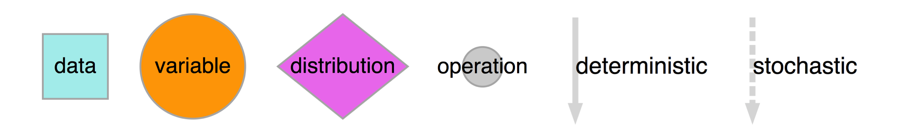

```{r setup, include=FALSE}
knitr::opts_chunk$set(echo = TRUE,
                      eval = TRUE,
                      comment = NA,
                      progress = FALSE)
set.seed(1)
library(greta)
```

<hr>

## How greta works

greta lets us build statistical models interactively in R, and then sample from them by MCMC. We build greta models with *greta array* objects, which behave much like R's array, matrix and vector objects for numeric data. Like those numeric data objects, greta arrays can be manipulated with functions and mathematical operators to create new greta arrays.

The key difference between greta arrays and numeric data objects is that when you do something to a greta array, greta *doesn't calculate the values* of the new greta array. Instead, it just remembers what operation to do, and works out the size and shape of the result.

For example, we can create a greta array `z` representing some data (a 3x3 matrix of 1s):
```{r ones}
(z <- ones(3, 3))
```
we can then create a new greta array `z2` by doing something to `z`:
```{r ones_op}
(z2 <- z + z ^ 2)
```
greta knows the result must also be a 3x3 matrix, but it doesn't try to calculate the results. Instead it treats the new greta array `z2` like a placeholder, for which it will calculate the results later.

Because greta only creates *placeholders* when we're building our model, we can construct models using greta arrays that represent unknown variables. For example, if we create a new greta array `a` representing some unknown values, we can still manipulate it as though it were data:

```{r free}
(a <- free(dim = c(3, 3)))
(a2 <- a + a ^ 2)
```

This allows us to create a wide range of models, like in the general-purpose modelling languages like BUGS and Stan. But unlike those languages we build greta models interactively in R so get feedback immediately if there's a mistake like a misspelled variable name or if one of our greta arrays has the wrong shape.

greta also lets us declare that a greta array follows a probability distribution, allowing us to train models using observed data, and to define prior distributions over our parameters, for Bayesian analyses.

The rest of this vignette walks through an example of fitting a model using greta.
<!-- If you'd like to see examples of some common models fitted in greta and with equivalent BUGS and Stan code, take a look at [Example models](example_models.html). -->
If you'd like more technical details about how greta works under the hood, check out [How does this work?](how_does_this_work.html).

<hr>

## Building a model

The rest of the vignette explains step-by-step how to build, visualise and fit a model with greta. We'll be stepping through a model for linear regression between two of the variables in the [`iris`](https://en.wikipedia.org/wiki/Iris_flower_data_set) dataset, which is included with base R. The model is *semi-Bayesian*, just to illustrate how to do both Bayesian (specifying priors over variables) and frequentist (no priors) inference in greta. In a real analysis it might make more sense just to pick one of those two approaches.

Here's the whole script to specify and fit the model:

```{r first_model, eval = FALSE}
library(greta)

# data
x <- as_data(iris$Petal.Length)
y <- as_data(iris$Sepal.Length)

# variables and priors
int = free()
coef = normal(0, 3)
sd = lognormal(0, 3)

# operations
mean <- int + coef * x

# likelihood
distribution(y) = normal(mean, sd)

# defining the model
model <- define_model(int, coef, sd)

# plotting
plot(model)

# sampling
draws <- mcmc(model, n_samples = 1000)
```

Throughout this example, and the rest of greta's documentation, `<-` is used when assigning *deterministic* values, and `=` when assigning variable or *stochastic* values. This makes the model code a little bit clearer to read, since `=` corresponds to the `~` symbol used to define stochastic relationships in BUGS and Stan. However, it doesn't actually make any difference to the model which assignment operator you use.

<hr>

### Data

The first section of the script takes the iris data (which is automatically loaded) and converts the two columns we care about into greta arrays:

```{r data}
x <- as_data(iris$Petal.Length)
y <- as_data(iris$Sepal.Length)
```

The greta function `as_data()` converts other R objects into greta arrays. In this case it's converting numeric vectors (the two columns of the iris dataframe) into greta arrays. `as_data()` can also convert matrices and R arrays with numeric, integer or logical (`TRUE` or `FALSE`) values into greta arrays. It can also convert dataframes to greta arrays, so long as all elements are either numeric, integer or logical. 

E.g. we can convert the first 5 rows and 4 columns of the iris dataframe, and print the result:

```{r print_greta_array}
as_data(iris[1:5, 1:4])
```

Whenever `as_data()` converts logical values to greta arrays, it converts them to 1s (for `TRUE`) and 0s (for `FALSE`). E.g. if we first convert the last column of `iris` from a factor into a logical vector, we can see this:

```{r logical_data}
(is_setosa <- iris$Species[c(1, 41, 81, 121)] == 'setosa')
as_data(is_setosa)
```

You can also see from this example that greta arrays always consider a vector as either a column vector (the default) or a row vector, and greta arrays always have at least two dimensions:
```{r dim}
dim(as_data(is_setosa))
```

#### explicit vs. automatic conversion

For many models, we don't *have* to explicitly convert data to greta arrays, the R objects will be converted automatically when we do an [operation](#Operations) on them. That's handy for when we want to use constants in our model because it saves us manually converting numbers each time. However, it's good practice to explicitly convert your data to a greta array using `as_data()`. This has two advantages: it lets greta work out the names of your data greta arrays (e.g. `x` and `y` in our example) which it can use when [plotting](#Plotting) the model; and `as_data()` will check your data for missing (`NA`) or non-finite (`Inf` or `-Inf`) values, which will break the model.

#### data structures

greta also provides some convenience functions to generate fixed numeric values. `ones()` and `zeros()` create greta arrays filled with either 1 or zero, and with the specified dimensions:

```{r structures}
ones(1, 3)
zeros(2, 2)
```
The `greta_array()` function is generalises this to let you create greta arrays with any values, in the same way as R's `array()` function:

```{r greta_array}
greta_array(pi, dim = c(2, 2))
greta_array(0:1, dim = c(3, 3))
```

`greta_array()` is just a thin wrapper around `array()`, provided for convenience. A command like `greta_array(<some arguments>)` has exactly the same effect as: `as_data(array<some arguments>)`.

<hr>

### Variables and priors

The second section of the script creates three greta arrays to represent the parameters in our model:
```{r variables}
int = free()
coef = normal(0, 3)
sd = lognormal(0, 3)
```

#### free variables

The first line uses the `free()` function to create a greta array `int` representing a variable - an unknown value that we will learn when we fit the model to data. `free()` has three arguments. The first two arguments determine the constraints on this parameter; we left them at their default setting of `lower = -Inf, upper = Inf` meaning the variables can take any value on the real number line. The third argument gives the dimensions of the greta array to return, in this case we left it at its default value of 1x1 (a scalar).

```{r int}
int
```

If we had instead wanted a 2x3 array of positive variables we could have created it like this:
```{r positive_free}
free(lower = 0, dim = c(2, 3))
```

#### variables with probability distributions

Variable greta arrays that are created with `free()`, like `int`, are not associated with probability distributions. I.e. we haven't made any assumptions or statements about what distribution we expect their values to follow. That's normally the case for a frequentist analysis, but for a Bayesian model we need to specify *prior distributions* over our parameters, stating the distribution we expect them to be drawn from (*before* considering the data we're using in the model).

In our example script, we simultaneously create the variables `coef` and `sd`, and state the prior distributions for them, using two of greta's probability distribution functions. Each of these distributions takes as arguments the distribution's parameters (either as numbers or other greta arrays), as well as the dimensions of the resulting greta array. As before, we left the dimensions argument at its default value to create scalar greta arrays:

```{r priors}
coef
sd
```

greta implements a number of common probability distributions, and more are being added. You can see a list of the currently available distributions in the `?greta-distributions` helpfile.

#### creating priors with `distribution()`

greta's probability distributions have two roles: to create variables following a certain distribution; and, when used in combination with the `distribution()` function, to state the distribution of an existing greta array.

In fact, creating a new variable using a probability distribution is the same as first creating a free variable (with the appropriate constraint) and then stating that it follows a distribution. So our code in the script for creating `coef` is equivalent to this:
```{r normal_prior2, eval = FALSE}
coef = free()
distribution(coef) = normal(0, 3)
```

The former is somewhat similar to the BUGS approach, where the variable and its distribution are defined at the same time. The latter approach (using `distribution()`)
is similar to Stan code in that the variable is defined first, and the distribution statement added later.

As well as taking more lines of code, the second approach relies on us to get the constraints of the free variable right. Because `sd` must be positive to be a valid standard deviation parameter, the `distribution()` approach for that parameter would look like this:

```{r sd_distribution, eval = FALSE}
sd = free(lower = 0)
distribution(sd) = lognormal(0, 3)
```

#### Truncated distributions

In general, it's easier to define parameters with priors just by using the probability distributions, like we did in the example script. However `distribution()` has two other uses: it can be used to define a [likelihood](#Likelihood) over observed data; and it can be used to create variables with truncated distributions.

If we define a free variable with constraints (using `lower` and `upper`), we can then assign it a probability distribution, and greta will instead use the truncated probability distribution, usng the specified constraints. For example, to define a variable `z` that has a standard normal distribution truncated between -1 and 2, we can do:

```{r truncated}
z = free(lower = -1, upper = 2)
distribution(z) = normal(0, 1)
z
```

Truncation like this isn't yet implemented for all probability distributions, but greta will let you know if it can't truncate the distribution.

<hr>

### Operations

The third section of the script uses mathematical operators to combine some of our parameters and data, to calculate the predicted sepal lengths, for a given parameter set:

```{r linear_predictor}
mean <- int + coef * x
```

Because both `int` and `coef` are both scalars, the resulting greta array `mean` has the same dimensions as `x`; a column vector with 150 elements:

```{r mean}
dim(mean)
head(mean)
```

greta arrays can be manipulated using R's standard arithmetic, logical and relational operators; including `+`, `*` and many others. The  `` ?`greta-operators` ``) helpfile lists the operators that are implemeneted for greta arrays. You can also use a lot of common R functions for numeric data, such as `sum()`, `log()` and others. the available functions are listed in the `` ?`greta-functions` `` helpfile. All of these mathematical manipulations of greta arrays produce 'operation' greta arrays.

#### Extract and replace

We can use R's extract and replace syntax (using `[`) on greta arrays, just like with R's vectors, matrices and arrays. E.g. to extract elements from `mean` we can do:

```{r extract}
mean[1:3]
```

We can assign values from one greta array to another too. For example, if we wanted to create a matrix that has random normal variables in the first column, but zeros everywhere else, we could do:

```{r replace}
z <- zeros(4, 3)
z[, 1] <- normal(0, 1, dim = 4)
z
```

R's subset operator `[` has an argument `drop`, which determines whether to reduce the number of dimensions of a array or matrix when the object has zero elements in that dimension. By default, `drop = TRUE` for R objects, so matrices are automatically converted into vectors (which have dimension `NULL`) if you take out a single column:

```{r drop}
z <- matrix(1, nrow = 2, ncol = 2)
dim(z[, 1])
dim(z[, 1, drop = FALSE])
```

greta arrays must always have two dimensions, so greta always acts as though `drop=FALSE`: 

```{r drop_greta}
z_greta <- as_data(z)
dim(z_greta[, 1])
```

#### Functions

We can write our own functions for greta arrays, using the existing operators and functions. For example, we could define the [inverse hyperbolic tangent function](https://en.wikipedia.org/wiki/Inverse_hyperbolic_function#Inverse_hyperbolic_tangent) for greta arrays like this:

```{r function1}
atanh <- function (z)
  (log(1 + z) - log(1 - z)) / 2

atanh(z_greta)
```

<hr>

### Likelihood

With the predicted sepal length `mean`, we can now define a likelihood for the observed sepal length data `y`:
```{r likelihood}
distribution(y) = normal(mean, sd)
```

With the syntax `distribution(<lhs>) <- <rhs>`, we are stating that the greta array on the left `<lhs>` has the same distribution as the greta array on the right `<rhs>`. In this case both `<lhs>` (`y`) and `<rhs>` are column vectors with the same dimensions, so each element in `y` has a normal distribution with the corresponding parameters.

<hr>

### Defining the model

Now all of the greta arrays making up the model have been created, we need to combine them and set up the model so that we can sample from it, using `define_model()`:

```{r hidden_model, echo = FALSE}
x <- as_data(iris$Petal.Length)
y <- as_data(iris$Sepal.Length)
int = free()
coef = normal(0, 3)
sd = lognormal(0, 3)
mean <- int + coef * x
distribution(y) = normal(mean, sd)
```
```{r define}
model <- define_model(int, coef, sd)
```

`define_model()` returns a 'greta model' object, which combines all of the greta arrays that make up the model. We can pass greta arrays as arguments to `define_model()` to flag them as the parameters we're interested in. When sampling from the model with `mcmc()` those will be the greta arrays for which samples will be returned. Alternatively, we can run `define_model()` without passing any greta arrays, in which all of the greta arrays (except for data greta arrays) in the working environment will be set as the targets for sampling instead.

<hr>

### Plotting

greta provides a plot function for greta models to help you visualise and check the model before sampling from it.
```{r plot, eval = FALSE}
plot(model)
```
```{r plot_hidden, echo = FALSE, results='hide'}
gr <- plot(model)
fname <- tempfile(fileext = '.png')
DiagrammeR::export_graph(gr,
                         file_name = fname,
                         file_type = 'png',
                         width = 852,
                         height = 970)
```
```{r plot_show, echo = FALSE, out.width = 500}
knitr::include_graphics(fname)
```

The greta arrays in your workspace that are used in the model are all represented as nodes (shapes) with names. These are either data (squares; `x` and `y`), variables (large circles;  `int`, `coef`, `sd`) or the results of operations (small circles; `mean`). The operations used to create the operation greta arrays are printed on the arrows from the arrays they were made from.
There are also nodes for greta arrays that were *implicitly defined* in our model. The data nodes (squares) with numbers are the parameters used to define the prior distributions, and there's also an intermediate operation node (small circle), which was the result of multiplying `coef` and `x` (before adding `int` to create `mean`).

The fourth type of node (diamonds) represents probability distributions. These have greta arrays as parameters (linked via solid lines), as well as values (linked via dashed lines). Distributions calculate the probability density of the values, given the parameters and their distribution type.

For example, a plot of just the prior distribution over `coef` (defined as `coef = normal(0, 3)`) shows the variable `coef` as the value, and the parameters as data, all leading into the normal distribution:

```{r plot_coef, echo = FALSE, results='hide'}
coef = normal(0, 3)
m_coef <- define_model(coef)
gr <- plot(m_coef)
fname <- tempfile(fileext = '.png')
DiagrammeR::export_graph(gr,
                         file_name = fname,
                         file_type = 'png',
                         width = 436,
                         height = 432)
```
```{r plot_coef_show, echo = FALSE, out.width = 256}
knitr::include_graphics(fname)
```

It's the same for the model likelihood, but this time the distribution's parameters are a variable (`sd`) and the result of an operation (`mean`), and the value of the distribution is given by data (the observed sepal lengths `y`):

```{r plot_likelihood, echo = FALSE, results='hide'}
sd = free()
y <- as_data(iris$Sepal.Length)
mean <- ones(150)
distribution(y) = normal(mean, sd)
m_likelihood <- define_model(sd)
gr <- plot(m_likelihood)
idx <- which(gr$nodes_df$label == 'mean\n')
gr$nodes_df$shape[idx] <- 'circle'
gr$nodes_df$fillcolor[idx] <- 'lightgray'
gr$nodes_df$width[idx] <- 0.2
gr$nodes_df$height[idx] <- 0.2
fname <- tempfile(fileext = '.png')
DiagrammeR::export_graph(gr,
                         file_name = fname,
                         file_type = 'png',
                         width = 400,
                         height = 432)
```
```{r plot_likelihood_show, echo = FALSE, out.width = 235}
knitr::include_graphics(fname)
```

Here's a legend for the plot (it's in the  `` ?`greta-model` `` helpfile too):

```{r legend_show, echo = FALSE, out.width = 750}

```

#### Installing DiagrammeR

These plots are made possible by the [DiagrammeR R package](http://rich-iannone.github.io/DiagrammeR/). Installing greta doesn't automatically install DiagrammeR, because DiagrammeR auto-installs a number of packages, including igraph, that can be time consuming and tedious to install on high-performance computing systems. If we try to plot but don't already have DiagrammeR installed, greta will prompt you to do so. We can install DiagrammeR and its dependencies with:

```{r install_diagrammer, eval = FALSE}
install.packages('DiagrammeR')
```

<hr>

### Sampling

When defining the model, greta combines all of the distributions together to define the *joint density* of the model, a measure of how likely (or probable, if we're being Bayesian) are a particular candidate set of values for the variables in the model.

Now we have a greta model that will give us the joint density for a candidate set of values, so we can use that to carry out inference on the model. We do that using an Markov chain Monte Carlo (MCMC) algorithm to sample values of the parameters we're interested in, using the `mcmc()` function:

```{r mcmc, message=FALSE, results='hide', progress = FALSE}
draws <- mcmc(model, n_samples = 1000)
```

Here we're using 1000 steps of the static Hamiltonian Monte Carlo (HMC) algorithm, which uses the gradients of the joint density to efficiently explore the set of parameters. By default, greta also spends 100 iterations 'warming up' and burning in the sampler.

`draws` is an `mcmc.list` object, from the coda R package. So we can use functions from coda, or one of the many other MCMC software packages that use this format, to plot and summarise the MCMC samples.

```{r coda_summary}
summary(draws)
```
The MCMCvis package makes some nice plots of the MCMC chain and the parameter estimates
```{r mcmcvis, out.width=c('400px', '400px'), fig.height=4, fig.width=5, fig.show='hold'}
library (MCMCvis)
MCMCtrace(draws)
MCMCplot(draws, xlim = c(-1, 5))
```

#### Tweaking the sampler

Static HMC is currently the only sampling algorithm available in greta. Unlike other HMC samplers (like [NUTS](https://en.wikipedia.org/wiki/Stan_(software)#Algorithms)), static HMC won't automatically tune the sampler for us If we want to make our MCMC more efficient, we can try tuning the HMC parameters via the `control` argument. The stepsize parameter `epsilon` is the most important one, shrinking that will make the sampler take smaller steps, which can help if greta tells us that a lot of samples are being rejected.

A downside of HMC is that it can't be used to sample discrete variables (e.g. integers), so we can't specify a model with a discrete distribution (e.g. Poisson or Binomial), unless it's in the likelihood. If we try to build such a model, greta will give us an error when we run `define_model()` stage. Future versions of greta will implement samplers for discrete MCMC, as well as self-tuning versions of HMC.

<hr>

